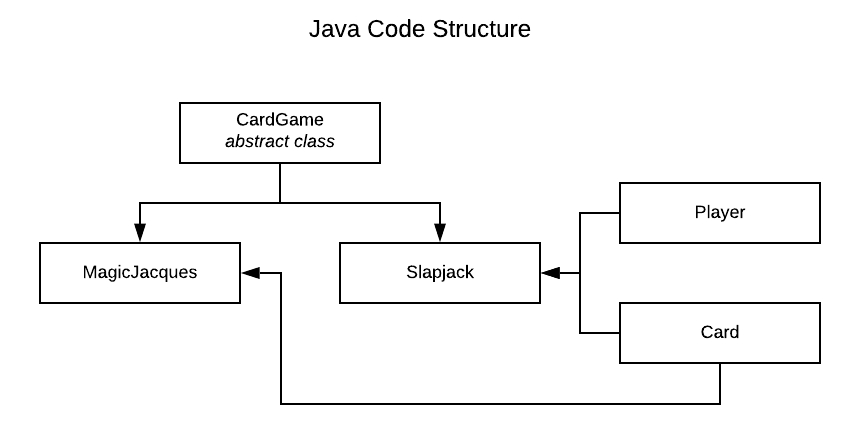

# Jack's Arcade: Design
By Sahil Kapur

## I. How to Run Code
After downloading/cloning the repository onto the local machine, navigate to the root of the project directory.

Type `./build.sh` and the arcade will load. Players pick the game by entering “tokens” (typing in a number). 1 token will run Slapjack. Two tokens will run Magic Jacques. All other inputs will end the session.

Project must be executed from Linux terminal.

## II. Introduction

### Background

As part of the application process for the 2020 Kleiner Perkins Fellowship, applicants are tasked with creating “a console-based (i.e. runs in terminal) unix-compatible interactive card game.”

### Desired Outcomes
The goal of this projects is to showcase engineering talent and creativity during the application review process. Key stakeholders include the reviewers of the application.

### Game Selection

I first developed “Slapjack,” as it was a simple game to understand for new users and allowed for abstraction.

Once this was developed, I began crafting an adventure game, centered around the theme of “cards.” Though not a typical "card game", players must use cards in the game. This portion is to highlight creativity.

## III. Playing Games

### Slapjack
<u>Time to play: 3 min</u>

The goal of Slapjack is to win over all the cards. The game finishes when all other players run out of cards. The player who holds all the cards at the end wins.

The instructions are simple:

1. Players start with 26 cards, face down.
2. Each player takes turns taking the top card from their deck, and turning it over in the middle of all players.
3. If the card is a Jack, the first player to "slap" (hit the card) wins the round. They take the Jack and all the players in the pile.
4. If the card is not a Jack, it simply goes into the middle of the pile.
5. If players slap a card that is not a Jack, they opponent wins the round and takes the cards in the pile.

In this version, hitting "enter" is equivalent to slapping the card. Typing "c" will allow users to pass. Cards are automatically unveiled.

### Magic Jacques
<u>Time to play: 5 - 7 min</u>

Magic Jacques is an adventure-based story game where users explore a new world they wake up into. They must make decisions as they progress, and use playing cards to stay alive. A comprehensive rule list is below:

1.	Do not die

If players fail the quest, they restart from the last stage they passed. Part of the game is figuring out the available moves and looking critically for hints in the game. At any stage, users can ask for:

1.	Options (all the possible moves)
2.	Hints

## IV. Design Choices

### Language

Java was a simple choice, as I had the most experience with data structures and application design in Java. Java’s class structure simplified the design process, as I could factor repeated code across all games into a parent class. Finally, processing objects in games allowed for cleaner code.

### Code Structure

1.  CardGame: contains methods and implementation common across card games, including if I were to make new games

2. Slapjack: defines the slapjack game. Subclass of CardGame. Uses Player and Card objects.

3.	Player: Defines a game player with cards, name, etc.

4. Card: Defines a game card. Has info about name, ASCII image.

5. Magic Jacques: defines the MagicJacques game. Subclass of CardGame. Uses Card object. 

### Data Structures

1. Magic Jacques uses no data structures

2. Slapjack uses a Queue to contain each player’s cards and an ArrayList to contain the pile of cards in the center.

### Algorithm Choices/Code Factoring

#### Slapjack

Slapjack uses no “special” algorithms, but is cleanly factored to reduce repetition at every stage.

At each round:

- Code puts down the next player’s card, increasing the pile size

  - Pulls the top card from player’s Stack of cards and appends to common pile

- Times the user’s response (pass/slap)

  - If the user slapped within time and the card is a Jack, transfer pile to their deck

  - If the user slapped too late and the card is a Jack, CPU gets the pile
  - If the user slapped and the card is not a Jack, CPU gets the pile

  - If the user did not slap but the card is a Jack, CPU gets the pile

  - Print number of cards for each player

- Change the current player and repeat

#### Magic Jacques

Magic Jacques uses a “stage” sequential code flow. Most of the code is defining the story for the game and checking user inputs against “correct” moves. The most common function is lineOut(), which prints the next line of the game, sets the hint, and sets all the possible options.

## V. Edge Cases

### Slapjack

 In effort to reduce code repetition, the same functions are used to print updates. However, the English language has specific syntax that depends on the noun. For example:

1.	“<strong>CPU</strong> <strong>puts</strong> down one card and <strong>has</strong> 1 <strong>card</strong> remaining.”
2.	“<strong>You</strong> <strong>put</strong> down one card and <strong>have</strong> 2 <strong>cards</strong> remaining.”

The same function is used to print both statements, so we must check the subject and verb agreement with every print statement and set the correct tenses.

### Magic Jacques

Similar to Slapjack, English makes the game a bit difficult. Since users can enter any command, we must accomodate different ways of saying the correct command. To do this, we automatically convert all inputs to lower case and remove whitespace. 

Most equality conditions use `.contains()` to check if the user input matches the expected input, just in case users have additional information in the command.

### Runtime Environment

Though we know we must run on a Linux machine, there are many variations. These include differences in screen sizes, resolutions, Unicode outputs, etc. The games use ASCII “images” and emojis to create a better experience, but these may not render the same across systems.

1. Screen sizes: build.sh checks screen size before it runs to make sure the terminal session can fit the images used in the games.

2. Emojis: Mac terminals support emojis, but other Linux systems may not. They render them as boxes with a Unicode representation. A design decision was made to display the emojis anyway, because the emojis are not critical to the games (cards still have ASCII letters and numbers).

## VI. Testing

To test games, I enlisted "beta testers" by sending out the games to friends and watching them interact with the games. Watching them struggle/enjoy different parts of playing allowed me to understand which parts of the game to focus on.

